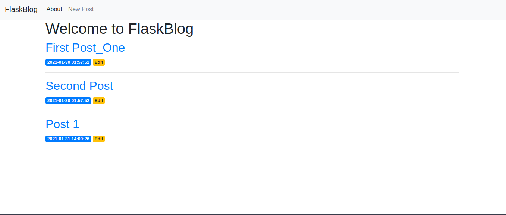
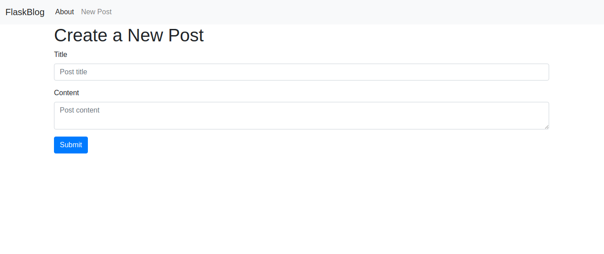
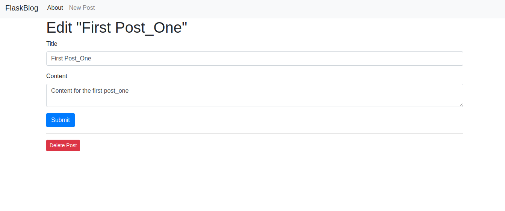

# CRUD COM FLASK

Este sistema faz operações de um crud com o framework Flask.

## Objetivo

Este programa tem como objetivo ser uma aplicação de conhecimento de estudos na linguagem python, o framework Flask e o banco de dados Sqlite3.

## Tecnologias

`Obs: É necessário ter um ambiente de desenvolvimento Python instalado em sua máquina.`

- [Python 3.8](https://www.python.org/downloads/)

- [VsCode](https://code.visualstudio.com/download)

- [Flask](https://flask.palletsprojects.com/en/1.1.x/installation/https://flask.palletsprojects.com/en/1.1.x/installation/)

- [Sqlite](https://www.sqlite.org/download.html)

- [Sqlite Browser](https://sqlitebrowser.org/dl/)

## Screenshots

## Licença

Este projeto está sob a licença MIT.

## Autor

Mateus Souza de Jesus, formado em Analise e Desenvolvimento de Sistemas, pelo Centro Universitário Leonardo da Vinci. Estudo a linguagem Python, e também ciência de dados.
